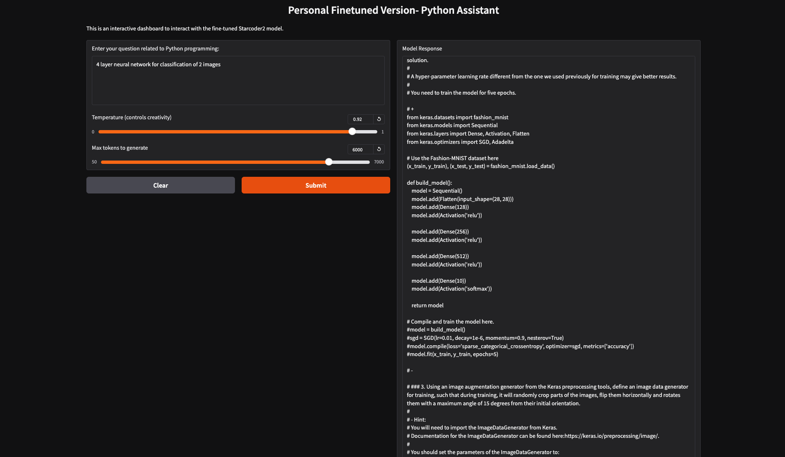
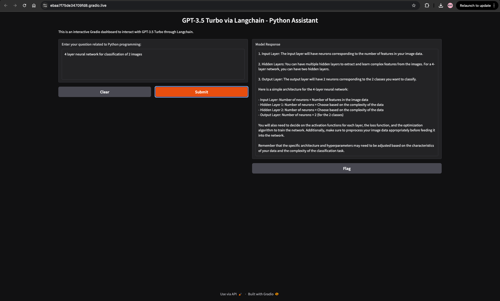
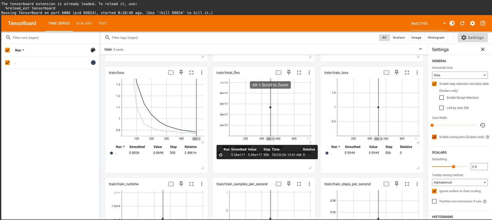
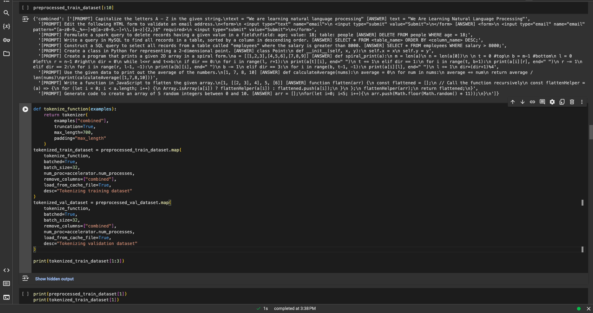
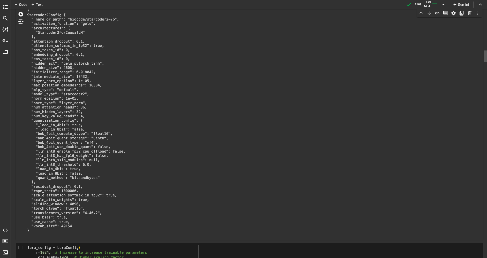

# Coderbuddy: StarCoder2 Fine-Tuning for Reliable Code Generation

In a world of AI models often burdened by misinformation and hallucinations, StarCoder2 Fine-Tuning takes a bold step towards making coding education reliable, accurate, and accessible to everyone—from beginners to experts. With this project, we address the challenge of providing trustworthy AI-generated code while minimizing misleading information.

## Overview

This project fine-tunes StarCoder2 (7B) to generate highly accurate and contextually relevant Python code snippets, focusing on reducing hallucinations. Utilizing limited GPU resources, the model was trained on 18,000 GitHub Python repositories for just one epoch, yet still outperformed GPT-3.5 Turbo in accuracy. Imagine what more could be achieved with greater resources!

## Key Features

Efficient Training with Limited Resources: Fine-tuned using quantization and LoRA (Low-Rank Adaptation), making this process feasible even on minimal hardware.

Parameter-Efficient Techniques: Leveraged attention mechanism fine-tuning by freezing most feed-forward layers to minimize computational load.

User-Friendly Gradio Interface: Interactive web interface allowing users to generate, explore, and understand code effortlessly. Adjustable temperature settings let users observe how hallucinations arise with model flexibility.

Learning Through Exploration: Encourages users to experiment with hyperparameters, making the model a learning tool, not just a black-box generator.

## Why This Matters

Accurate Code Generation: Reduces hallucinations, ensuring more reliable coding suggestions for developers.

Community Focused: Built for the community to learn, explore, and use, empowering developers with tools to innovate despite resource limitations.

Beginner-Friendly: Designed to not overwhelm beginners, offering clean, concise examples for practical learning.

## Get Started

Check out the model and start experimenting today! [Model Link](https://lnkd.in/g7Jsi5uN)

Let’s make AI-driven coding more reliable, accessible, and powerful—together.

## Acknowledgments

A big thank you to the AI/ML community that inspires continued learning and exploration. This is just the beginning; let’s keep pushing the boundaries!
